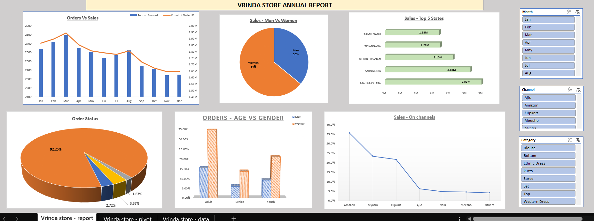

# Store Data Analysis (Excel Project)

## Overview
This project analyzes sales and inventory data for a retail store using Microsoft Excel.  
It demonstrates practical business analytics through data cleaning, pivot tables, charts, and dashboards.

## Features
- Organized and cleaned raw store datasets  
- Pivot tables for sales trends and product performance  
- Charts and dashboards for visual insights  
- Inventory tracking and decision-making support  

## Tools Used
- Microsoft Excel (formulas, pivot tables, charts, dashboards)

## Purpose
To showcase how Excel can be applied to real-world business scenarios for effective data analysis and reporting.

## Project Preview
Here’s a snapshot of the Excel dashboard used for store data analysis:

Dashboard showing monthly sales trends, top states, and customer demographics.
